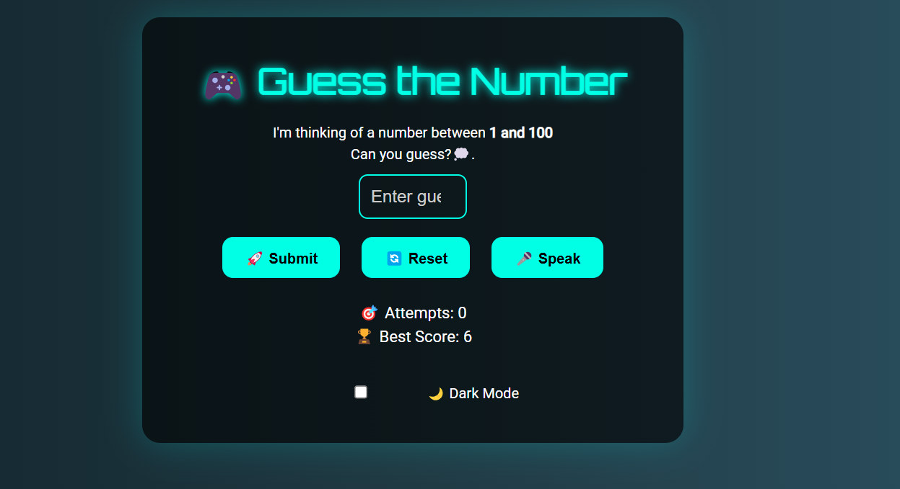

# 🎮 Number Guessing Game

A fun **Number Guessing Game** built with HTML, CSS, and JavaScript. The game lets you guess a number between 1 and 100, gives you feedback on whether your guess is too high or too low, and provides hints to guide you closer to the correct number. Additionally, you can use voice input to make your guesses, and the game has a cool **confetti animation** when you win!

## Features
- **Voice Input Support**: Guess the number by speaking it out loud.
- **Hints**: Get real-time hints based on how close your guess is to the correct number.
- **Sound Effects**: Enjoy sound effects for correct, high, and low guesses.
- **Confetti Animation**: Celebrate your success with animated confetti when you guess correctly.
- **Dark Mode**: Toggle dark mode for a better night-time experience.
- **Score Tracking**: Track your best score (the least number of attempts to guess correctly) using **localStorage**.

## How to Play
1. Enter a number between 1 and 100 in the input box.
2. Click the "Submit Guess" button or press **Enter** to submit your guess.
3. You'll receive feedback on whether your guess is **Too Low**, **Too High**, or **Correct**.
4. Try to guess the number in the least number of attempts to set a **Best Score**.
5. You can also use voice input to say your guess by clicking the "🎤 Speak Guess" button.

## Screenshots



## Live
# https://numbergue.netlify.app/

## How to Run Locally
1. Clone this repository to your local machine:

   ```bash
   git clone https://github.com/your-username/number-guessing-game.git
